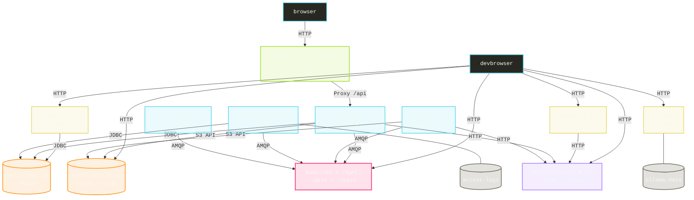
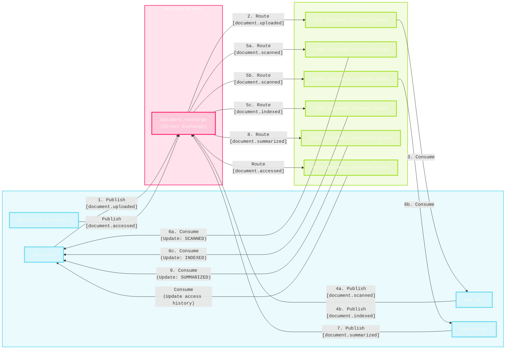

# Document Management System (DMS)

Group A

## Quick Start

```sh
./run.sh args... #  or  .\run.ps1 args...
```

### Arguments

Both files support the following arguments:

```sh
       # default (no argument) → same as "start"
start  # build & compose up
stop   # compose down all running containers
dev    # build & compose up all non-local images (PG, NGINX, ...)
```

2.Access

- [Web UI](http://localhost:80)
- [MinIO](http://localhost:9001)
- [RabbbitMQ](http://localhost:15672)
- [Adminer](http://localhost:9090)
- [Elasticsearch](http://localhost:9200)
- [Kibana](http://localhost:5601)

## Project Structure

- `dms`
  - `docs` Requirements & Documentation
  - `rest` Spring REST API
  - `ocr` Spring OCR Scanner
  - `ui` React Web UI

## Project Architecture



### Spring REST API

- JDK: `temurin-22`
- SpringBoot 3.5.5
- Swagger Annotations (OpenAPI) 2.2.12

### Messaging


